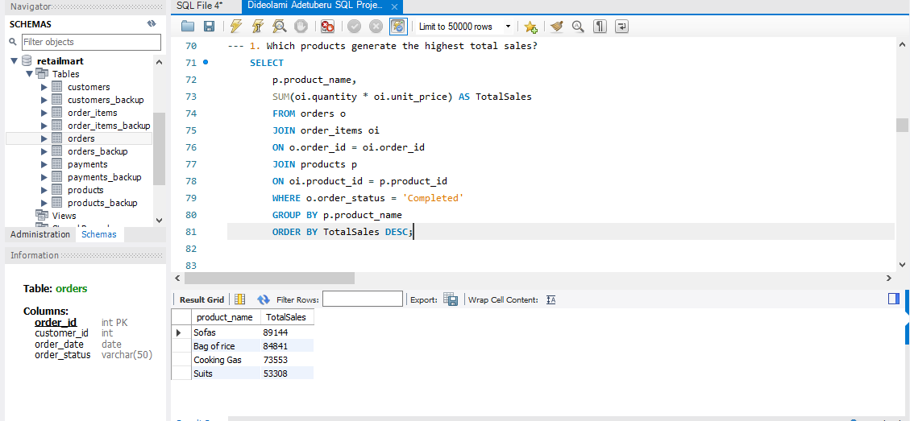
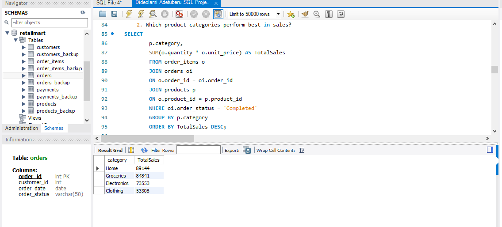
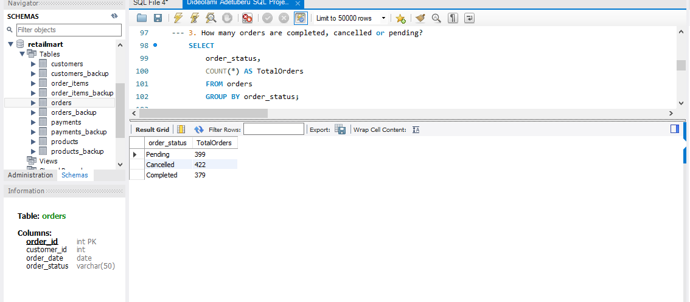
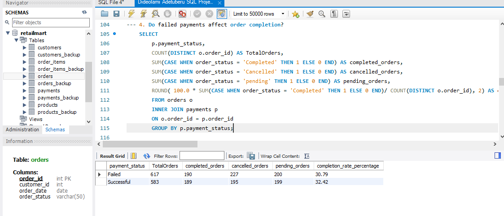
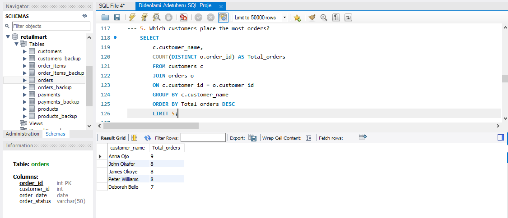
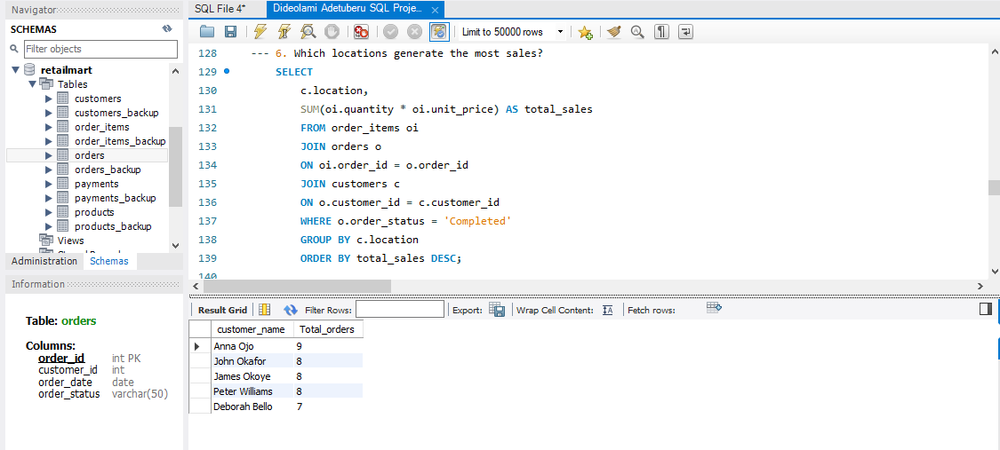

# Retail-Sales-Customer-Behavior-Analysis

## Introduction
Retail Mart is an e-commerce company that sells products online across multiple locations. The management has been concerned about order cancellations, failed payments, low-value customers, and product performance; hence, they need better understanding of customer behavior, sales performance and reasons for failed performance. This project focuses on analyzing 1 year (January 2024–January2025) retail sales transactional data to explore how customers interact with the platform, how products perform across categories and how payment outcomes affect order completion. Rather than building dashboards, this project emphasizes query logic and analytical thinking to support data-driven decision making.

## Problem Statement
Although Retail Mart records healthy sales volumes, management has identified several concerns that could impact long-term profitability and customer retention. These include:
  - A noticeable number of **cancelled** **orders**
  - **Failed payments** affecting successful order completion
  - Difficulty identifying **high-value** **customers**
  - Limited visibility into **top-performing products** and **categories**

Without proper analysis, these issues may lead to inefficient business strategies. This project aims to use SQL to investigate these problems and provide insights that can help management understand customer behavior, sales performance and operational bottlenecks.

## Data Sourcing
This project used a simulated retail e-commerce database designed for SQL analysis.

1.Source: Simulated retail e-commerce dataset

2.Time Period: January 2024 – January 2025

3.The tables include: 
  - Customers – customer details and location information
  - Products – product details, categories and pricing 
  - Orders – order records, customer id and order status
  - Order-items – order details, quantity, pricing
  - Payments – payment details, payment status, payment date and payment method

## Data Transformation & Cleaning
Data preparation was carried out using SQL to ensure the dataset was properly structured and analysis- ready. The following steps were performed:

  - Created a relational database schema to organize the dataset and define logical relationships between tables.
  - Imported raw data into structured tables, including customers, products, payments, orders and order-items. Customers, products, payments, orders and order-items.
  - Established table relationships using INNER JOIN to combine the appropriate tables for analysis.
  - Applied filters to exclude incomplete or irrelevant records and focus om valid records.
  - Applied appropriate grouping logic to prevent duplicates.
  - Created calculated fields such as total sales by deriving values from unit price and quantity.
  - Extracted date components (month and year) from order dates to enable time-based analysis.
  - Aggregated data using GROUP BY with SUM, COUNT, and AVG to summarize sales performance and customer behavior.

## Analysis 
This analysis was conducted using SQL to evaluate Retail Mart’s sales performance, customer behavior, order outcomes and payment effectiveness. Multiple tables were joined to generate meaningful insights across customers, products, payments and locations.

1.**Product sales performance**

Total sales were calculated by multiplying quantity and unit price at the order-item level and aggregating results by product and filtering them by order status that were completed. This analysis identified the highest revenue-generating product, highlighting areas driving overall business performance.

2.**Category sales performance**

Total sales were calculated by multiplying quantity and unit price at the order-item level and aggregating results by product category and filtering them by order status that were completed. This analysis identified the product categories that performed best in sales, highlighting categories with lower and higher contributions.

3.**Order status distribution**

Orders were grouped by status to assess the proportion of completed, cancelled, and pending orders. This provided visibility into order fulfillment efficiency and revealed a significant volume of non-completed orders, indicating potential operational challenges.

4.**Payment status and order completion**

Payment data was joined with order records to examine whether failed payments impacted order completion. Completion rates were calculated for each payment status revealing that failed and successful payments showed similar completion rates.

5.**Customer purchasing behavior**

Customer purchasing behavior was analyzed by counting distinct orders per customer. This enabled the identification of high-value customers based on order frequency.

6.**Geographical Sales Performance**

Sales were aggregated by customer location to determine which regions generated the highest revenue. This analysis revealed location-based differences in sales contribution and order completion rates, providing insight into regional demand.

## Insights & Findings
  - Sofas dominate with** 89k** in sales, bag of rice follow strongly with **85k**, cooking gas with **74k** and suits with **53k**.
  - Home categories perform best in sales with **89k**, Groceries category follows as the second leading with **85k**, Electronics with **74k** and then lastly Clothing with **53k**.
  - Out of **1200** orders, retail mart accounted for **379** completed orders, **399** pending orders and **422** cancelled orders.
  - Failed payments have a completion rate of **30.79%** while successful payments have a completion rate of **32.42%**. Initial analysis shows similar order completion rates for failed and successful payments (*30.79% vs 32.42%**), suggesting that payment status alone does not strongly influence order completion. This may be due to multiple payment attempts per order or alternative payment methods.
  - The top 5 customers are Anna Ojo (9 orders), James Okoye (8 orders), John Okafor (8 orders), Peter Williams (8 orders) and Deborah Bello (7 orders).
  - Lagos generates the highest revenue with **87k** in sales, Ibadan with **74k**, Abuja with **82k** and Port Harcourt with **58k**.
  - Lagos records the highest total sales and has the highest order completion rate at **33.97%**, indicating both strong demand and efficient order fulfillment. Port Harcourt, despite having the lowest total sales, achieves a higher completion rate (*30.00%**) than Abuja (**29.01%**), suggesting better conversion efficiency relative to its sales volume.
  - Payment method affects order completion slightly. Card payments perform best suggesting faster confirmation and better integration. Cash payment has the highest total orders but moderate completion rate, high pending + cancelled suggests cash orders may be more likely to stall. Transfers perform the weakest, likely due to delayed confirmation, manual verification or customer abandonment during transfer. Thus, it influences completion, but operational factors still matter more.

## Recommendations 
  - Prioritize top products & categories: Focus on Bag of Rice, Sofas, Cooking Gas, and Suits; promote underperforming categories with targeted discounts.
  - Optimize payment processes: Encourage card payments, streamline cash/transfer orders, and implement reminders or retries for failed payments to boost completion rates.
  - Enhance customer engagement: Reward top repeat customers with loyalty programs, personalized offers, and exclusive promotions.
  - Leverage regional performance: Expand efforts in Lagos (high revenue & completion) and replicate Port Harcourt’s efficient fulfillment practices in lower-performing regions.
  - Monitor operations closely: Track pending/cancelled orders, improve payment timing, and align marketing, operations, and fulfillment teams to ensure smooth order completion.

## Conclusion 
This project used SQL to analyze Retail Mart’s sales performance, customer behavior, and order outcomes using a relational e-commerce dataset. By joining multiple tables and applying aggregations, conditional logic, and date functions, meaningful insights were generated to support data-driven decision-making.
The analysis showed that sales performance is driven primarily by completed orders, with revenue concentrated in specific product categories and customer locations. While overall sales activity appears strong, the presence of cancelled and pending orders highlights opportunities to improve order fulfillment and operational efficiency. Additionally, customer purchase patterns reveal a group of high-value customers who contribute disproportionately to order volume. The findings highlight opportunities to optimize revenue, improve order fulfillment processes, and strengthen customer retention. Further analysis could incorporate promotional data, customer demographics, or time-based purchasing trends to better understand the drivers of sales performance and customer engagement.

## Author
DIDEOLAMI ADETUBERU | DATA ANALYST | EXCEL | SQL | POWER BI
